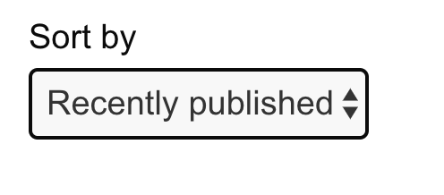

# shinyGovstyle


> Apply Gov styled components and formats in shiny


## Overview

This package provide some custom widgets to style your app like gov.uk.  There are a varity of widgets available, inlcuding select, radio, checkboxes as well as styling for headers and footers.


Top view details of gov.uk comnponents please visit https://design-system.service.gov.uk/.  Most components from https://design-system.service.gov.uk/components/ are available to use through this package.


Installation :
```r
devtools::install_github("moj-analytical-services/shinyGovstyle")
```

or install via conda with:
```r
conda install -c rosswyatt r-shinygovstyle
```

To use error and word count elements you will need to load useShinyjs from shinyjs in the ui:
```r
  shinyjs::useShinyjs()
```


## Components available :


  - [Gov style layout](#gov-style-layout)
  - [Banner](#banner)
  - [Radio button](#radio-button)
  - [Checkbox](#checkbox)
  - [Button](#button)
  - [Select](#select)
  - [Date](#date)
  - [File input](#file-input)
  - [Text input](#text-input)
  - [Text area input](#text-area-input)
  - [Warning](#warning)
  - [Insert text](#insert-text)
  - [Details](#details)
  - [Panel](#panel)
  - [Error](#error)

### Gov style layout

Create a gov style look to the page with a header, footer, font and layout: <br>


```r
ui <- fluidPage(
  #font(),
  shinyGovstyle::header("Justice", "Prototype", logo="shinyGovstyle/images/moj_logo.png"),
  gov_layout(size = "full",
        tags$br(),
        tags$br(),
        tags$br(),
        tags$br(),
        tags$br()
      ),
  footer(TRUE)
)

server <- function(input, output, session) {}
```
Note: You can only use gov.uk font on service.gov.uk (see https://design-system.service.gov.uk/styles/typography/)

### Banner

Add a banner to the header to state in beta or alpha : <br>


```r
ui <- fluidPage(
  shinyGovstyle::header("Justice", "Prototype", logo="shinyGovstyle/images/moj_logo.png"),
  banner("banner", "beta", 'This is a new service – your <a class="govuk-link" href="#">feedback</a> will help us to improve it.'),
  gov_layout(size = "full",
        tags$br(),
        tags$br(),
        tags$br(),
        tags$br(),
        tags$br()
      ),
  footer(TRUE)
)

server <- function(input, output, session) {}
```

### Radio button

Create a gov style radio button : <br>


```r
radio_button_Input(inputId = "name_changed", label = "Have you changed your name?",
                   choices = c("Yes", "No"), inline = TRUE,
                   hint_label = "This includes changing your last name or spelling your name differently.")
```


### Checkbox

Turn checkboxes into gov style ones : <br>


```r
checkbox_Input(
  inputId = "checkID", 
  cb_labels = c("Waste from animal carcasses", "Waste from mines or quarries", "Farm or agricultural waste"),
  checkboxIds = c("op1", "op2", "op3"),
  label = "Which types of waste do you transport?",
  hint_label = "Select all that apply.")
```

Note that you currently access the values seperately through the inputIds you supply or all values through the main inputID.

### Button

Gov style button with different styles :


```r
shinyGovstyle::button_Input(inputId = "btn1", label = "default"),
shinyGovstyle::button_Input(inputId = "btn1", label = "start", type = "start"),
shinyGovstyle::button_Input(inputId = "btn1", label = "secondary", type = "secondary"),
shinyGovstyle::button_Input(inputId = "btn1", label = "warning", type = "warning")
```

### Select

Gov style dropdown select  :


```r
shinyGovstyle::select_Input(
  inputId = "sorter", 
  label = "Sort by",
  select_text = c("Recently published", "Recently updated", "Most views", "Most comments"),
  select_value = c("published", "updated", "view", "comments"))
```

### Date

Gov style date input  :


```r
date_Input(
  inputId = "date1",
  label = "What is your date of birth?",
  hint_label = "For example, 31 3 1980")
```
Note that you currently access the individual values by adding a affix of _day, _month and _year or the full date in dd/mm/yy by using the inputID.


### File input

Gov style file input component  :


```r
file_Input(inputId = "file1", label = "Upload a file")
```


### Text input

Gov style text input component  :


```r
text_Input(inputId = "txt1", label = "Event name")
```

### Text area input

Gov style text area input component  :


```r
text_area_Input(
  inputId = "text_area",
  label = "Can you provide more detail?",
  hint_label = "Do not include personal or financial information, like your National Insurance number or credit card details.")
```

You can also add a word count to the options, which requires an addition arguement in the server :


```r
ui <- fluidPage(
  shinyjs::useShinyjs(),
  shinyGovstyle::header("Justice", "", logo="shinyGovstyle/images/moj_logo.png"),
  gov_layout(size = "full",
        text_area_Input(
          inputId = "text_area",
          label = "Can you provide more detail?",
          hint_label =  "Do not include personal or financial information, like 
                         your National Insurance number or credit card details.",
          word_limit = 300)
  ),
  footer(TRUE)
)

# Define server logic required to draw a histogram
server <- function(input, output, session) {
  observeEvent(input$text_area,
    word_count(inputId = "text_area", input = input$text_area, word_limit = 300)
  )
}
```

### Warning

Gov style warning component  :


```r
warning_text(inputId = "warn", text = "You can be fined up to £5,000 if you do not register.")
```

### Insert text

Gov style insert text component  :


```r
insert_text(inputId = "insertId",
            text = "It can take up to 8 weeks to register a lasting power of attorney 
                    if there are no mistakes in the application.")
```


### Details

Gov style details component  :


```r
 details(
  inputId = "detID",
  label = "Help with nationality",
  help_text = "We need to know your nationality so we can work out which elections you’re 
              entitled to vote in. If you cannot provide your nationality, you’ll have to 
              send copies of identity documents through the post.")

```

### Panel

Gov style panel component  :


```r
panel_output(
  inputId = "panId", 
  main_text = "Application complete", 
  sub_text = "Your reference number <br> <strong>HDJ2123F</strong>")
```

### Error

Add errors to copmponents when not filled in correctly.  Most components have an option to add  :


```r
ui <- fluidPage(
  shinyjs::useShinyjs(),
  shinyGovstyle::header("Justice", "", logo="shinyGovstyle/images/moj_logo.png"),
  gov_layout(size = "full",
        text_area_Input(
          "text_area",
          "Can you provide more detail?",
          "Do not include personal or financial information, like your National Insurance number or credit card details.",
          word_limit = 300, error = TRUE, error_message = "Error"),

        button_Input("btn1", "Toggle error")
  ),
  footer(TRUE)
)

server <- function(input, output, session) {
  err <<- FALSE
  observeEvent(input$btn1,{
    if (err) {
      err <<- FALSE
      error_off("text_area")
    }
    else {
      err <<- TRUE
      error_on("text_area", "You have an error")
    }
  }
  )
}
```
